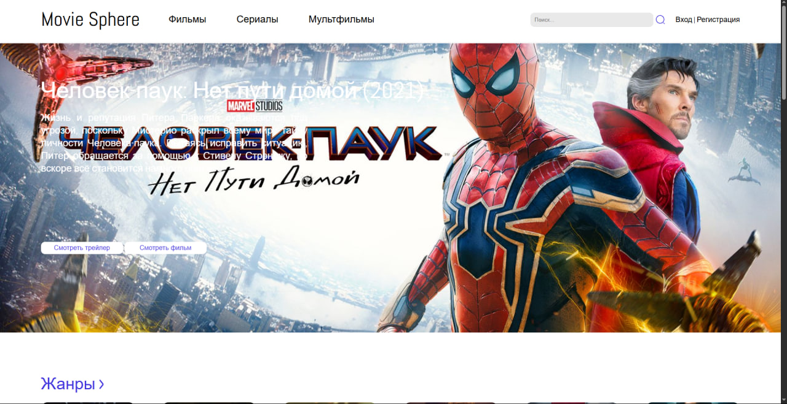
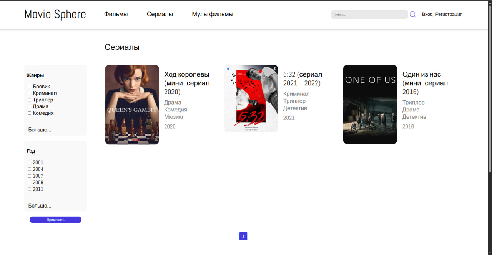
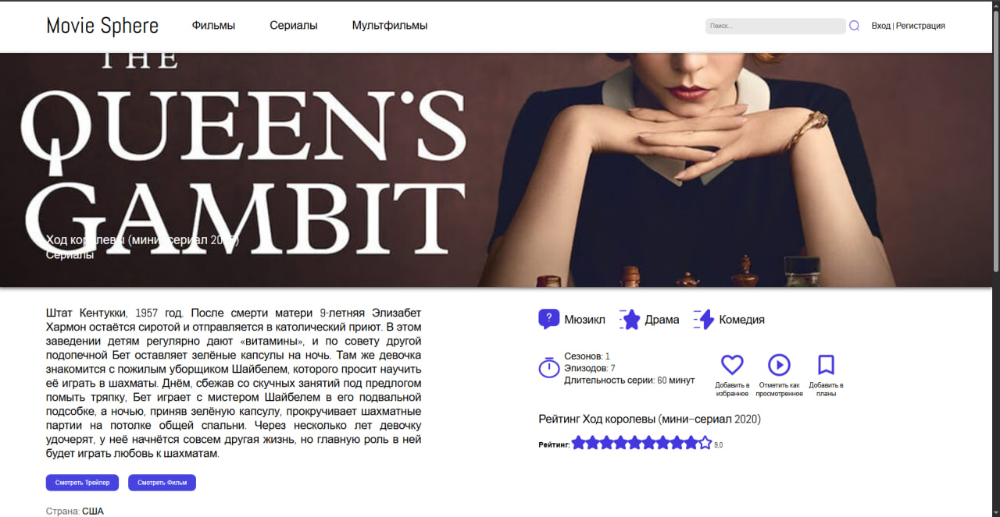

# 🎬 MovieSphere

Веб-приложение для поиска и просмотра информации о фильмах, сделанное на **Python/Django**.  
Интегрировано с внешним API для получения актуальных данных о фильмах.

---

## 🖼️ Скриншоты

| Главная страница | Поиск фильма | Детали фильма |
|-----------------|---------------|----------------|
|  |  |  |

---

## 🚀 Функционал

- Поиск фильмов по названию через API  
- Просмотр описания, рейтинга и даты выхода  
- Адаптивный веб-интерфейс  
- Админка Django для управления контентом  

---

## 🧩 Технологии и стек

- **Язык:** Python 3  
- **Фреймворк:** Django  
- **База данных:** PostgreSQL / SQLite3  
- **API:** REST API  
- **Frontend:** HTML, CSS, Django Templates, Bootstrap  
- **Инструменты:** Git, VS Code  

---

## 💡 О проекте

Проект создан для изучения интеграции веб-приложений с внешними API.  
Помог освоить Django ORM, маршрутизацию, обработку запросов и работу с внешними данными.

---

## 🔗 Автор

**Maden Tynbayev**  
📍 Astana, Kazakhstan  
[GitHub](https://github.com/IDGAFM)
